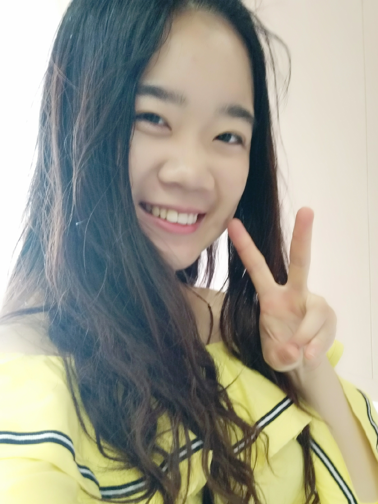

<b>Lab Alumni</b>

<b>Ji Xia</b> 

 
　　Ji’s research focuses on how motivational forces (goals, evolutionary needs, etc.) could shape people’s cognitions and behaviors. Primarily, he’s interested in motivational factors that hold the potential in influencing how people react to persuasive information as well how they perceive their own reactions (metacognition) and subsequently, how these processes could affect the ways people form/change their attitudes. Ji is originally from China, and received his B.S. (in 2013) and M.S. (in 2016) degree from the University of Iowa.  He is currently pursuing his Ph.D. under Dr. Kenneth G. DeMarree at the SUNY University at Buffalo.
  

<b>Zhenrong (Neo) Chen</b> 

 
　　Zhenrong Chen (B.S. 2018, Biological Science, ShanghaiTech University) was one of the first members of ARLab, and is currently pursuing Master of Engineering Degree in Biomedical Engineering at the Nancy E. and Peter C. Meinig School of Biomedical Engineering at Cornell University. Realizing the potential challenges and prospects in technique management integration in the biological field, he hopes to enter a scientific consulting company after the program at Cornell. 
  

<b>沈凡婷 Fangting Shen</b> 
计算机 2015级本科 (CS 2015) 

 
目前就读于上海科技大学信息学院计算机专业，创新与创业专业辅修。擅长设计制作实体demo，习惯观察分析人物的性格与神态细节，喜欢音乐与乐团，也喜欢有挑战的东西。近期对"全网黑"这一现象的形成原因与网民的观点形成方式比较感兴趣，另在研究上海文化的形成原因
  

<b>俞家桐 Jiatong Yu</b> 
计算机 2015级本科 (CS 2015) 

 
就读于上海科技大学信息学院计算机科学与技术专业。目前对市场及用户研究十分感兴趣，正在学习消费者心理学方面的相关知识。近期正在进行群体与个体消费行为的研究。
  

<b>张星雅 Xingya Zhang</b> 
电子信息 2015级本科 (EE 2015) 

 
目前就读于上海科技大学信息学院电子信息工程专业，同时辅修创管学院金融学。对于商业市场、消费者行为分析有强烈兴趣，擅长于整合处理、图形化大量数据信息并加以分析。近期内致力于消费方式相关的研究。
  

<b>朱汪俊 Wangjun Zhu</b> 
计算机 2015级本科 (CS 2015) 

 
就读于上海科技大学信息科学与技术学院计算机科学专业。喜欢天文，对心理学也有一定的兴趣，善于倾听，希望通过学习了解人类的行为模式。
  

<b>曾祥琛 Xiangchen Zeng</b> 
计算机 2015级本科 (CS 2015) 

 
毕业于上海科技大学信息科学与技术学院计算机科学与技术专业。理想成为一名独立游戏开发者，正在努力学习计算机图形学和相关技术，同时对心理学也有一定的兴趣和研究。擅长头脑风暴和网站运维。希望通过实验室经历加强自己的开发水平和思考能力。 
现在在游戏公司担任游戏策划。
  

<b>曹龄云 Lingyun Cao</b> 
计算机 2015级本科 (CS 2015) 

 
I am an undergraduate majoring in Computer Science and concern games and security. Experiences about websites have been obtained. Recently, I am learning Maya and Blender.
  

