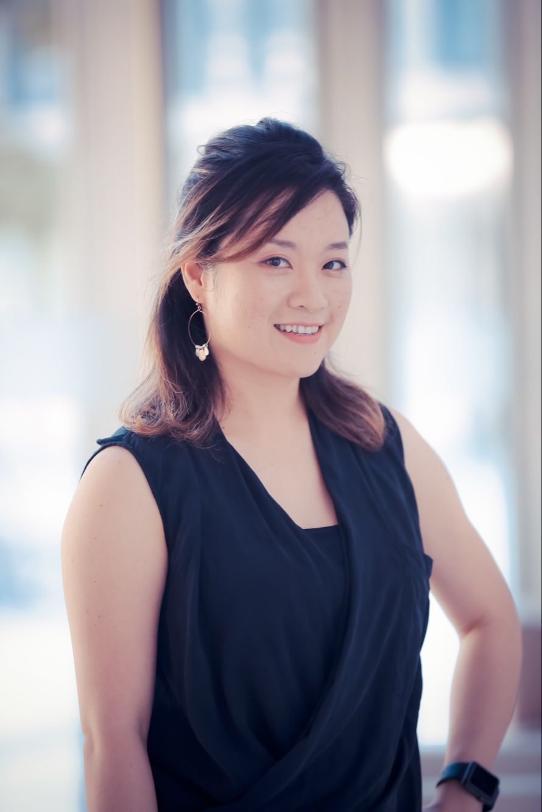

<b>研究员</b>

<b>杨丽凤</b> 

 
杨丽凤博士主要研究消费者行为心理学。杨博士的态度研究实验室（Attitude Research Lab）当前侧重于研究人们对品牌，市场，企业，以及政府在信息推广中涉及的各种营销推广行为的态度，心理，及行为表现。当前研究项目包括各种品牌（Branding）策略，说服(Persuasion)策略，广告措辞(Framing)效应，人喜好与厌恶并存(Ambivalence)的矛盾态度，以及赞助营销行为(Cause-Related Marketing)效应。

<b>研究助理工程师</b>

<b>季佳颖</b> 

 
 
<b>夏霁</b> 

 

<b>实验室合伙人</b>

<b>红组：实验组</b>

<b>蓝组：技术组</b>

