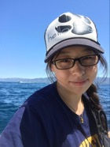
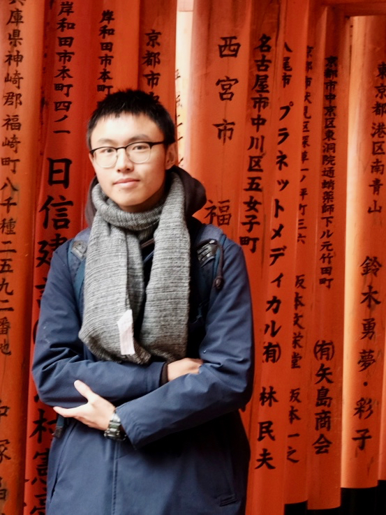

<b>研究员</b>

<b>杨丽凤</b> 

 
主要研究消费者行为心理学。杨博士的态度研究实验室（Attitude Research Lab）当前侧重于研究人们对品牌，市场，企业，以及政府在信息推广中涉及的各种营销推广行为的态度，心理，及行为表现。当前研究项目包括各种品牌（Branding）策略，说服(Persuasion)策略，广告措辞(Framing)效应，人喜好与厌恶并存(Ambivalence)的矛盾态度，以及赞助营销行为(Cause-Related Marketing)效应。

<b>研究助理工程师</b>

<b>季佳颖</b> 

 
毕业于香港浸会大学传播学专业。现为上海科技大学创业与管理学院杨丽凤副教授的研究助理，以及态度研究实验室管理员。主要负责研究辅助以及实验室运营的工作。
  
<b>夏霁</b> 

 

<b>实验室合伙人</b>

<b>红组：智能组</b>

<b>方治欣</b> 

 
就读于上海科技大学信息科学与技术学院计算机科学专业。对心理和行为的分析极其有兴趣，正在学习行为学建模和C语言编程。网络社交相关话题的idea generator，最近致力于目标梯度(goal gradients)相关的研究。
  

<b>刘浩宇</b> 

 
就读于上海科技大学信息科学与技术学院电子信息工程专业。理想成为一名心理学研究者，正在努力学习实验心理学和行为科学统计方面相关知识，希望能够在实验心理学相关方向有所发展。擅长于实验设计，使用多元研究方法，对于各种现代社会现象都有一定的了解和兴趣。
  

<b>方雪</b> 

 
就读于上海科技大学物质科学与技术学院化学专业，辅修创新与创业专业。热爱跆拳道、绘画、钢琴和旅行，敢于挑战新领域、善于观察和分析细节、学科背景较为综合。立志成为一名教师。正在教育心理学、习惯养成和任务坚持、失败后的再恢复的相关领域进行研究。希望通过研究能够开发更有效的教育模式，帮助无法坚持完成任务的人群实现梦想。
  

<b>蓝组：技术组</b>

<b>张星雅</b> 

 
目前就读于上海科技大学信息学院电子信息工程专业，同时辅修创管学院金融学。对于商业市场、消费者行为分析有强烈兴趣，擅长于整合处理、图形化大量数据信息并加以分析。近期内致力于消费方式相关的研究。
  

<b>曾理</b> 

 
就读于上海科技大学信息科学与技术学院计算机科学与技术专业。热爱运动，擅长分析和计算。
  

<b>曾祥琛</b> 

 
就读于上海科技大学信息科学与技术学院计算机科学与技术专业。理想成为一名独立游戏开发者，正在努力学习计算机图形学和相关技术，同时对心理学也有一定的兴趣和研究。擅长头脑风暴和网站运维。希望通过实验室经历加强自己的开发水平和思考能力。
  

